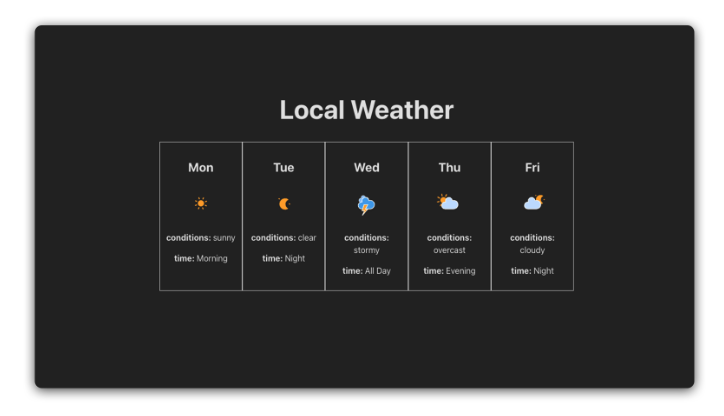
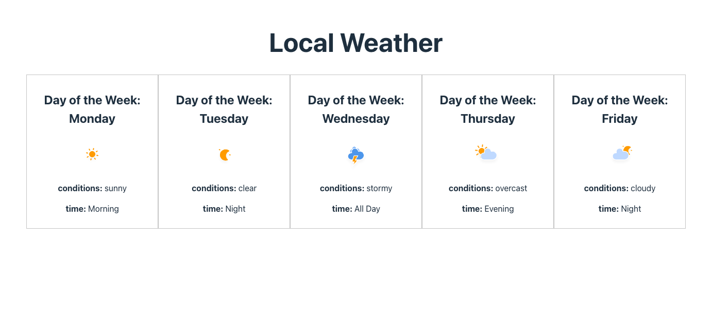

# React + Vite

This template provides a minimal setup to get React working in Vite with HMR and some ESLint rules.

Currently, two official plugins are available:

- [@vitejs/plugin-react](https://github.com/vitejs/vite-plugin-react/blob/main/packages/plugin-react) uses [Babel](https://babeljs.io/) for Fast Refresh
- [@vitejs/plugin-react-swc](https://github.com/vitejs/vite-plugin-react/blob/main/packages/plugin-react-swc) uses [SWC](https://swc.rs/) for Fast Refresh

## Expanding the ESLint configuration

If you are developing a production application, we recommend using TypeScript with type-aware lint rules enabled. Check out the [TS template](https://github.com/vitejs/vite/tree/main/packages/create-vite/template-react-ts) for information on how to integrate TypeScript and [`typescript-eslint`](https://typescript-eslint.io) in your project.

# Reactville

## React Components Lab

### About
- Welcome to Reactville, a constantly evolving virtual metropolis. Let’s build this digital town together, one component at a time.

- Reactville Weather Station is at the heart of the town, keeping everyone informed about the ever-changing weather. They’re in need of a tech upgrade and have called on you to develop their new 5-Day Weather Forecast App.

### Solution UI

### My Outcome UI

In this lab, you will create a user-friendly React application that displays a 5-day weather forecast. You’ll implement a dynamic, component-based structure and practice the core concept of passing data using props in React.

### Set Up via General Assembly Lab Information
- https://generalassembly.instructure.com/courses/720/assignments/16380?module_item_id=62932

### Exercise via General Assembly Lab Information
- https://generalassembly.instructure.com/courses/720/assignments/16380?module_item_id=62932

